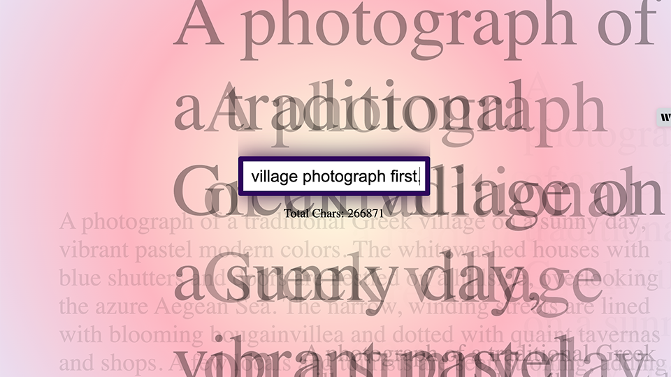

# Char Char

🤖 AI-Assisted (Gemini 1.5 Pro)

Char-Char is an experimental and fun web application designed to visualize character occurrences in text. The project leverages HTML, CSS, and JavaScript to create an interactive and engaging interface for users to input text and see the frequency of each character displayed dynamically. The visual representation helps in analyzing text data and understanding character distribution in a playful manner.

## Site
* 👉 [jsohndata.github.io/char-char/](https://jsohndata.github.io/char-char/)
